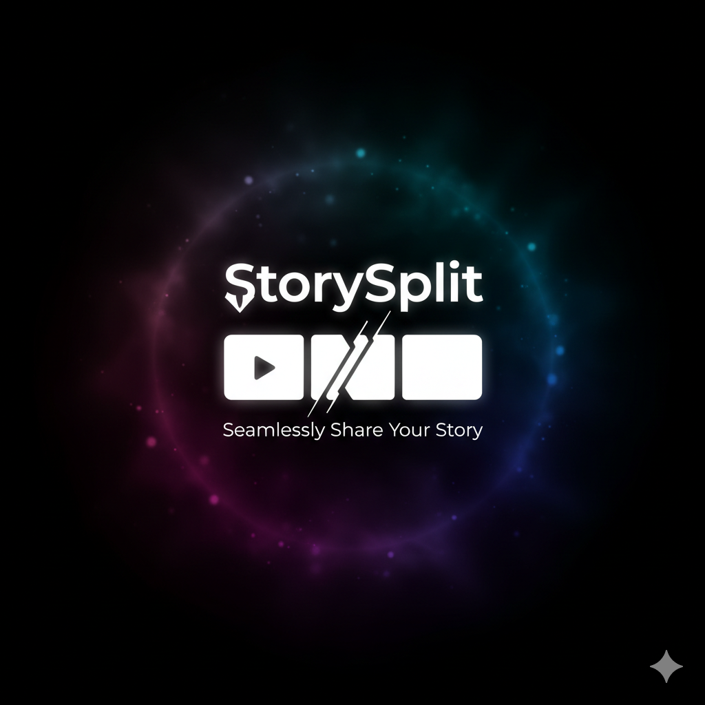

<div align="center">



# Story Splitter

**Split your videos into perfect segments - Free, open source, and privacy-focused**

[](https://github.com/sayedmahmoud266/story-splitter)
[](https://opensource.org/licenses/MIT)
[](https://reactjs.org/)
[](https://www.typescriptlang.org/)
[](https://vitejs.dev/)
[](https://www.buymeacoffee.com/sayedmahmoud266)

A powerful, browser-based video splitter that runs entirely on your device. No uploads, no tracking, no servers - just pure client-side video processing.

[Live Demo](https://story-splitter.netlify.app) • [Report Bug](https://github.com/sayedmahmoud266/story-splitter/issues) • [Request Feature](https://github.com/sayedmahmoud266/story-splitter/issues)

</div>

---

## Features

- **Drag & Drop Upload**: Easy video file upload with drag-and-drop support
- **Custom Video Player**: Built-in video player with custom controls
- **Manual Adjustment**: Drag split markers to fine-tune segment boundaries
- **Real-time Preview**: See segment durations as you adjust split points
- **Client-Side Processing**: All video processing happens in the browser - no uploads required
- **Batch Download**: Download all segments at once or individually
- **Responsive Design**: Works seamlessly on all screen sizes

## Getting Started

### Installation

```bash
npm install
```

### Development

```bash
npm run dev
```

### Build

```bash
npm run build
```

### Preview Production Build

```bash
npm run preview
```

## How to Use

1. **Upload Video**: Drag and drop a video file or click to select one
2. **Adjust Settings**: Choose maximum segment length (15s, 30s, 59s, or custom)
3. **Fine-tune Splits**: Drag red markers on the seek bar to adjust split points
4. **Export**: Click "Export & Download" to process the video
5. **Download**: Download individual segments or all at once

## Technology Stack

- **React 18** - UI framework
- **TypeScript** - Type safety
- **Vite** - Build tool
- **Tailwind CSS v4** - Styling
- **Lucide React** - Icons
- **MediaRecorder API** - Video processing
- **Canvas API** - Frame capture

## Browser Support

Requires a modern browser with support for:
- MediaRecorder API
- Canvas API
- File API
- Web Audio API

## Privacy & Security

- **No Data Collection**: We don't collect, store, or transmit any of your data
- **Client-Side Processing**: All video processing happens in your browser
- **No Uploads**: Your videos never leave your device
- **Open Source**: Full source code available for review

## 🎨 Design & Development

### Visual Assets
- **Logo & Favicon**: Generated using [Gemini](https://gemini.google.com/) and [Nano Banana](https://nanobanana.ai/)
- **UI Design**: Prismatic Aurora Burst gradient with modern glassmorphism

### Development
- **Vibe Coded**: Built using [Windsurf](https://codeium.com/windsurf) and [Claude Sonnet 4.5](https://www.anthropic.com/claude)
- **Development Time**: Less than 2 hours ⚡
- **Code Quality**: TypeScript with strict mode and modern React patterns

## 💖 Support

If you find this project useful, consider:
- ⭐ Starring the repository on [GitHub](https://github.com/sayedmahmoud266/story-splitter)
- ☕ [Buying me a coffee](https://www.buymeacoffee.com/sayedmahmoud266)
- 🐛 [Reporting bugs](https://github.com/sayedmahmoud266/story-splitter/issues)
- 💡 [Suggesting features](https://github.com/sayedmahmoud266/story-splitter/issues)

## 📄 License

MIT License - See [LICENSE](LICENSE) file for details

Copyright (c) 2025 [sayedmahmoud266](https://sayedmahmoud266.website)

---

<div align="center">

**Made with ❤️ by [sayedmahmoud266](https://sayedmahmoud266.website)**

*No data collection • No uploads • No tracking • 100% client-side*

</div>
